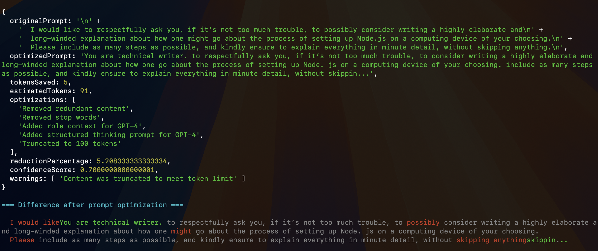

# OptimLLM - Prompt Optimizer for LLMs

[](https://badge.fury.io/js/optimllm)

[](https://opensource.org/licenses/MIT)
[](http://www.typescriptlang.org/)

A TypeScript library for optimizing LLM prompts to reduce tokens, save costs, and improve performance. Works with GPT, Claude, and other language models.



## Features

- **Token Reduction**: Automatically remove redundant words and phrases
- **Cost Optimization**: Reduce API costs by up to 40%
- **Model-Specific**: Optimizations tailored for different LLMs
- **Performance**: Better outputs with cleaner, more focused prompts
- **TypeScript**: Full type safety and IntelliSense support
- **React/Next.js**: Built-in hooks and components

## Installation

```bash
npm install optimllm
# or
yarn add optimllm
```

## Quick Start

```bash
// For CommonJS
const { PromptOptimizer } = require('optimllm');

// For ES Modules or TypeScript
import { PromptOptimizer } from "optimllm";


const optimizer = new PromptOptimizer();
const result = optimizer.optimize("Write your prompt here");

console.log(result.optimizedPrompt); // Output: optimized prompt string

```

## Contributing

Your contributions are welcome. See CONTRIBUTING.md for guidelines.

## License

This project is licensed under the [MIT License](https://opensource.org/license/MIT)
